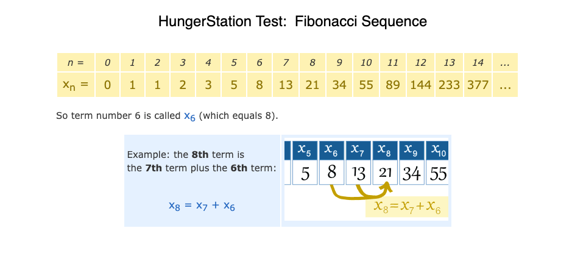
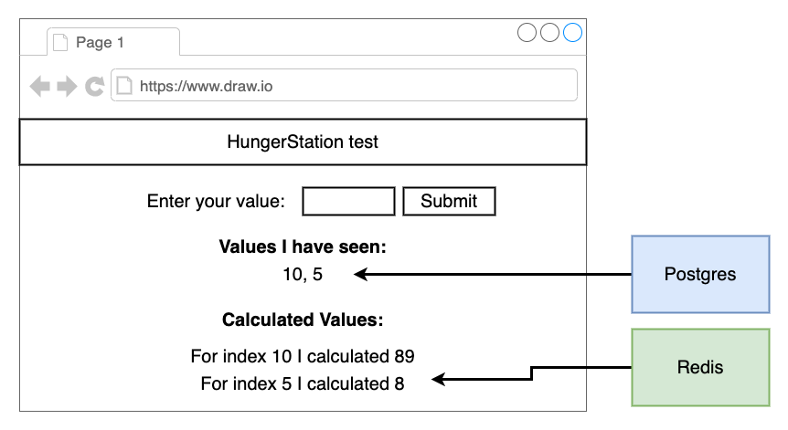
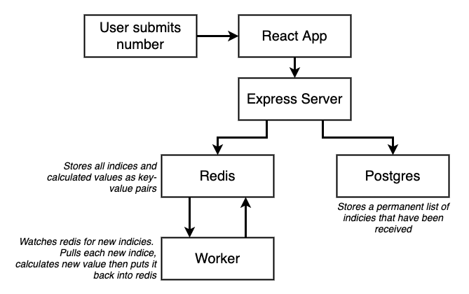
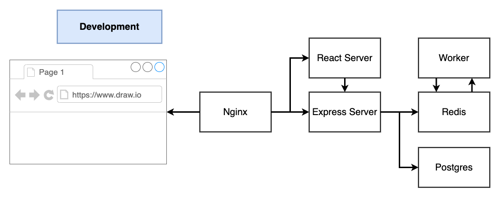
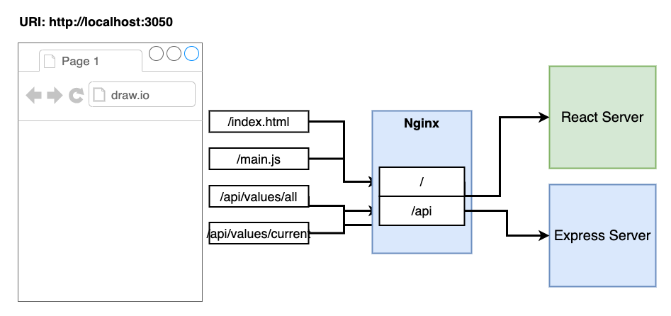
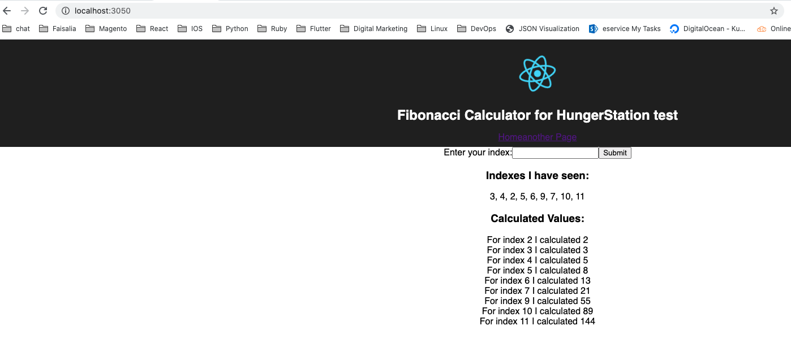
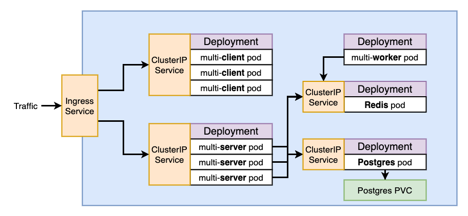
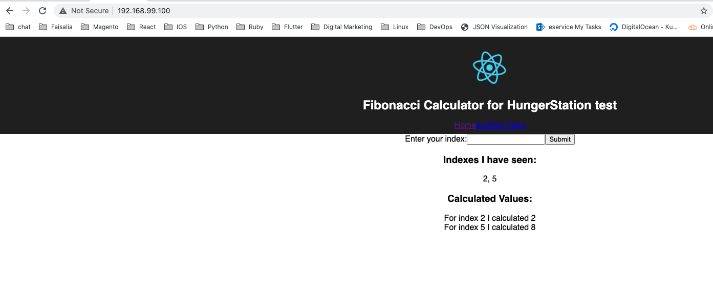

# Hunger Station test

it's a simple web app have the following components
 - React JS
 - Node JS
 - Redis 
 - Express JS
 - Postgres DB
 - Nginx

the application purpose is to calculate the fibonacci sequence. that's a series of numbers: 0, 1, 1, 2, 3, 5, 8, 13, 21, 34,
- the 2 is found by adding the two numbers before it (1+1),
- the 3 is found by adding the two numbers before it (1+2),

### Application Architecture
~~~~
When the customer submits a new number, it will be saved in Postgres DB as well as Redis. 
The worker component watch the new added index to redis to calculate the fibonacci result and display it.
~~~~

### Application Components

### Development Architecture

### Nginx Traffic 

---
## Docker Compose
~~~~
to test the docker compose please run the following command in the application root directory.
~~~~

> `docker-compose up`

>please ignore any javascript deprecated libraries 

> then visit the following link [localhost:3050](http://localhost:3050)

> the application view should be like the following screenshot

---
## Kubernetes Cluster Architecture

~~~~
to test the kubernetes manifest files please run the following comand in the application root directory.
~~~~

> `kubectl apply -f k8s/`

> get the minikube IP by running `minikube ip`

> then visit the resulted IP to get the web app. the application view should be like the following screenshot
>
>

---
## Helm

~~~~
to test the helm chart please run the following command in the root application directory.
note: if you still running K8s ckuster please run the following command to delete it, `kubectl delete -f k8s/`.
~~~~

> `helm install hungerstation ./helm/fib`

> get the minikube IP by running `minikube ip`
 
> then visit the resulted IP to get the web app. the application view should be like the following screenshot
>
>

---

Thanks so much for giving me the opportunity to do the test.

